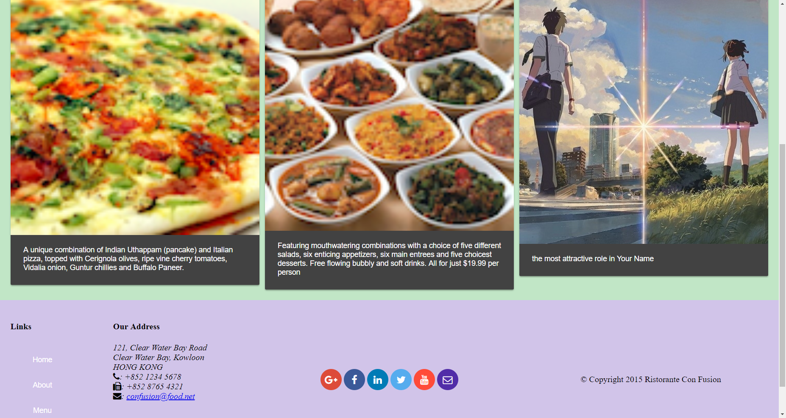

# [](https://github.com/NH1900)
# Catalogue
* [Background](#background)
* [Usage](#usage)
* [Content](#content)
    * Home
    * Log in
    * Menu
    * Contact us
    * About us
* [Future](#future)

# Background
Built an Online restaurant for students to ordering dishes.
# Usage
## Restaurant

This project was generated with [Angular CLI](https://github.com/angular/angular-cli) version 1.7.1.

### Development server

Run `ng serve` for a dev server. Navigate to `http://localhost:4200/`. The app will automatically reload if you change any of the source files.

### Code scaffolding

Run `ng generate component component-name` to generate a new component. You can also use `ng generate directive|pipe|service|class|guard|interface|enum|module`.

### Build

Run `ng build` to build the project. The build artifacts will be stored in the `dist/` directory. Use the `-prod` flag for a production build.

### Running unit tests

Run `ng test` to execute the unit tests via [Karma](https://karma-runner.github.io).

### Running end-to-end tests

Run `ng e2e` to execute the end-to-end tests via [Protractor](http://www.protractortest.org/).

### Further help

To get more help on the Angular CLI use `ng help` or go check out the [Angular CLI README](https://github.com/angular/angular-cli/blob/master/README.md).


# Content
## Home
In the home page, users can find specialty dishes and introduction ofthe resaurant. Users can directly slide images of dishes to add them to favorites dishes list.
To obtain the data flow from backend, I use RestAPI of Angular to geet the observable of data.
```Typescript
leader: Leader;
  dish: Dish;
  promotion: Promotion;
  dishErrMess: string;
  promotionErrMess: string;
  leaderErrMess: string;
  constructor(private dishservice: DishService,
    private promotionservice: PromotionService,
    private leaderservice: LeaderService,
    @Inject('BaseURL') private BaseURL) { }

  ngOnInit() {
    this.dishservice.getFeaturedDish().subscribe( dish => this.dish = dish,errmess => this.dishErrMess = <any>errmess);
    this.promotionservice.getFeaturedPromotion().subscribe(promotion => this.promotion = promotion,errmess => this.promotionErrMess = <any>errmess);
    this.leaderservice.getFeaturedLeader().subscribe(leader => this.leader = leader,errmess => this.leaderErrMess = <any>errmess);
  }
```
## Log in
Users can log in to our restaurant or create an account. After logging in, our system will recommend users some dishes baes on their ordering history.
Defining the format of an account and the valid input of password and username
```Typescript
describe('LoginComponent', () => {
  let component: LoginComponent;
  let fixture: ComponentFixture<LoginComponent>;

  beforeEach(async(() => {
    TestBed.configureTestingModule({
      declarations: [ LoginComponent ]
    })
    .compileComponents();
  }));

  beforeEach(() => {
    fixture = TestBed.createComponent(LoginComponent);
    component = fixture.componentInstance;
    fixture.detectChanges();
  });

  it('should create', () => {
    expect(component).toBeTruthy();
  });
```
## Menu
In Menu page, users can browser dishes to choose what they like
For each dish after clicking corresponding image,user can get into another page introducing dishdetails for that specific dish
In dishdetail page,users can leave message and add comments to that dish.
```Typescript
createForm(){
    this.commentForm = this.db.group({
      rating: 0,
      comment: ['', [Validators.required]],
      author: ['', [Validators.required, Validators.minLength(2)]],
    });
    this.commentForm.valueChanges
      .subscribe(data => this.onValueChanged(data));
    this.onValueChanged();
  }

  onValueChanged(data?: any) {
    if (!this.commentForm) { return; }
    const form = this.commentForm;
    for (const field in this.formErrors) {
      // clear previous error message (if any)
      this.formErrors[field] = '';
      const control = form.get(field);
      if (control && control.dirty && !control.valid) {
        const messages = this.validationMessages[field];
        for (const key in control.errors) {
          this.formErrors[field] += messages[key] + ' ';
        }
      }
    }
  }

  onSubmit() {
    this.commentdata = this.commentForm.value;
    this.disha.comments.push(this.commentdata);
    this.commentdata.date = new Date().toISOString();
    console.log(this.commentdata);
    this.commentForm.reset({
      rating: 0,
      comment: '',
      author: ''
    });
  }

```
## Contact us
In the contact page, Users can fill out their information to leave a message or directly contact us for some problems during ordering.
Still in this page,users' information will be stored in database.
```Typescript
createForm() {
    this.feedbackForm = this.fb.group({
      firstname: ['',[Validators.required, Validators.minLength(2), Validators.maxLength(25)] ],
      lastname: ['',[Validators.required, Validators.minLength(2), Validators.maxLength(25)] ],
      telnum: ['',[Validators.required, Validators.pattern] ],
      email: ['', [Validators.required, Validators.email] ],
      agree: false,
      contacttype: 'None',
      message: ''
    });
    this.feedbackForm.valueChanges
      .subscribe(data => this.onValueChanged(data));

    this.onValueChanged(); // (re)set validation messages now
  }

  onValueChanged(data?: any) {
    if (!this.feedbackForm) { return; }
    const form = this.feedbackForm;
    for (const field in this.formErrors) {
      // clear previous error message (if any)
      this.formErrors[field] = '';
      const control = form.get(field);
      if (control && control.dirty && !control.valid) {
        const messages = this.validationMessages[field];
        for (const key in control.errors) {
          this.formErrors[field] += messages[key] + ' ';
        }
      }
    }
  }

  onSubmit() {
    this.feedback = this.feedbackForm.value;
    console.log(this.feedback);
    this.fbservice.submitFeedback(this.feedback);
    this.feedbackForm.reset({
      firstname: '',
      lastname: '',
      telnum: '',
      email: '',
      agree: false,
      contacttype: 'None',
      message: ''
    });
  }
```
## About us
Users can find introduction about the restaurant and their owners
# Future
In the future based on customers' requirements I plan to add more functions suach as:self building service ....

